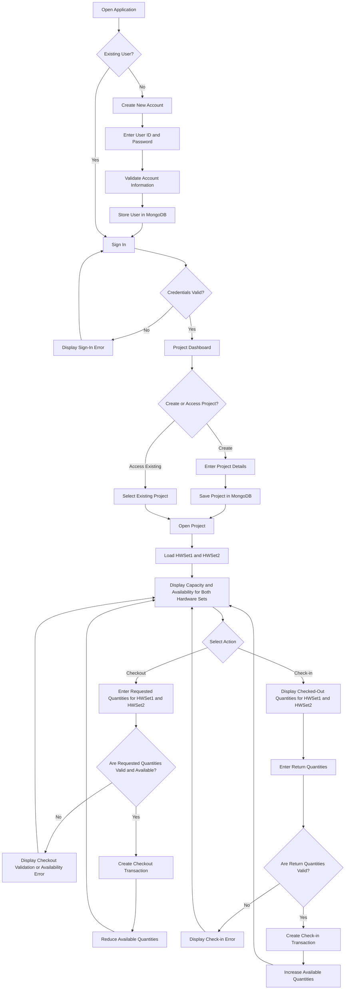
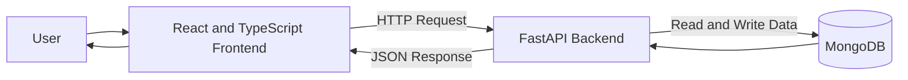

# HaaS Project Scope

## 1. Project Title

**Hardware-as-a-Service Management System**

------

## 2. Project Overview

This project will deliver a proof-of-concept web application for a Hardware-as-a-Service system.

The application will allow users to create an account, sign in securely, create or access a project, view available hardware resources, check out hardware, and check hardware back in.

The system will be developed within a four-week timeline using:

- React and TypeScript for the frontend
- FastAPI for the backend
- MongoDB for data storage
- GitHub for version control and collaboration
- GitHub Projects for task and issue tracking

The project will focus on delivering the required Minimum Viable Product before optional enhancements are considered.

--------

## 3. Project Objective

The objective of this project is to build a functional web application that allows users to manage hardware resources through an online interface.

The completed proof of concept should allow users to:

1. Create a new user account
2. Sign in using a user ID and password
3. Create a new project
4. Access an existing project
5. View hardware capacity and availability
6. Request and check out available hardware
7. Check hardware back in
8. View updated hardware availability
9. Access the deployed application through a public URL

---

## 4. Primary User

The primary user is a registered system user who needs to access hardware resources for a project.

The user should be able to:

- Create or access an account
- Create or select a project
- View available hardware
- Enter the desired hardware quantity
- Check out available resources
- Return resources through check-in
- View updated resource information

---

## 5. Minimum Viable Product

| Feature Area | Required Functionality |
|---|---|
| User Management | Create a new account and sign in securely |
| Project Management | Create a new project or access an existing project |
| Resource Management | View hardware capacity and availability |
| Hardware Request | Enter the desired quantity of a hardware resource |
| Checkout | Check out available hardware resources |
| Check-in | Return previously checked-out hardware |
| Database | Store user, project, resource, and transaction information |
| API | Connect the frontend to the database through FastAPI |
| Deployment | Provide a public URL accessible to the Proffessor and TAs |
| Documentation | Maintain project documentation and progress in GitHub |

---

## 6. Application Flow

## 7. Core Features

### 7.1 New User Account Creation

A new user should be able to create an account using:

- User ID
- Password
- Confirm password

The system should:

1. Validate that all required fields are completed.
2. Confirm that the password and confirm-password fields match.
3. Check that the user ID does not already exist.
4. Securely hash the password before storing it.
5. Store the user account in MongoDB.
6. Display a success or error message.

Additional fields such as name, email, organization, or intended use may be considered later as optional enhancements.

### 7.2 User Sign-In

A registered user should be able to sign in using:

- User ID
- Password

The system should:

1. Confirm that both fields are completed.
2. Search MongoDB for the user.
3. Compare the entered password with the stored hashed password.
4. Allow access if the credentials are valid.
5. Display an error if the credentials are invalid.

### 7.3 Project Creation

A user should be able to create a new project by entering:

- Project name
- Project ID
- Project description

The system should:

1. Validate all required fields.
2. Check that the project ID is unique.
3. Associate the project with the signed-in user.
4. Save the project information in MongoDB.
5. Open the project after successful creation.

### 7.4 Existing Project Access

A signed-in user should be able to:

1. View projects associated with their account.
2. Select an existing project.
3. Open the selected project.
4. Access the hardware-resource dashboard for that project.

### 7.5 Hardware Resource Dashboard

The system should display at least:

- HWSet1
- HWSet2

For each hardware set, the application should show:

| Field | Description |
|---|---|
| Hardware name | Name of the hardware set |
| Capacity | Total number of units |
| Available | Number currently available |
| Checked out | Number currently in use |
| Requested quantity | Quantity entered by the user |

Hardware information must be retrieved from MongoDB and must not be hard-coded in the frontend.

### 7.6 Hardware Checkout

A user should be able to:

1. View HWSet1 and HWSet2 together.
2. Enter a requested quantity for one or both hardware sets.
3. Submit the checkout request.

The system should validate that:

- The quantity is numeric.
- The quantity is greater than zero.
- The quantity does not exceed availability.
- A project is currently selected.

After a successful checkout, the system should:

- Create a checkout transaction.
- Associate it with the user and project.
- Reduce the available quantity.
- Store the transaction in MongoDB.
- Display a confirmation message.
- Refresh the hardware dashboard.

### 7.7 Hardware Check-in

A user should be able to return previously checked-out hardware.

The system should:

1. Display the checked-out quantities for HWSet1 and HWSet2.
2. Allow the user to enter a return quantity for one or both hardware sets.
3. Validate each return quantity against the quantity currently checked out.
4. Confirm that the return quantity does not exceed the checked-out quantity.
5. Create a check-in transaction.
6. Increase the available quantity.
7. Update the transaction information.
8. Display a confirmation message.

---

## 8. Technology Stack

| Layer | Technology | Purpose |
|---|---|---|
| Frontend | React and TypeScript | Build the user interface |
| Backend | FastAPI | Implement APIs and application logic |
| Database | MongoDB | Store users, projects, resources, and transactions |
| Version Control | GitHub | Manage code and documentation |
| Project Management | GitHub Projects | Track stories, tasks, bugs, and progress |
| Design | Figma | Create user flows and wireframes |
| Architecture | Mermaid or Draw.io | Create system diagrams |
| Testing | PyTest and manual testing | Verify workflows and backend behavior |
| Deployment | To be finalized | Host the application online |

---

## 9. High-Level Architecture

-----
## ## 10. In-Scope Features

The following features are included in the four-week project scope:

- New user account creation
- Secure sign-in
- Password hashing
- Project creation
- Accessing an existing project
- Viewing HWSet1 and HWSet2
- Viewing hardware capacity
- Viewing hardware availability
- Entering a requested hardware quantity
- Hardware checkout
- Hardware check-in
- User, project, resource, and transaction data storage
- React and FastAPI integration
- FastAPI and MongoDB integration
- Validation and error messages
- Cloud deployment
- GitHub-based project documentation
- GitHub-based issue and task tracking

---

## 11. Out-of-Scope Features

The following features are not required for the initial proof of concept:

- we will not let user checkout if the request > available, just show error
- Real physical hardware integration
- Billing or payment processing
- Hardware shipping and delivery tracking
- Native mobile applications
- Social login
- Multi-factor authentication
- Enterprise single sign-on
- Complex administrator permissions
- Multi-organization management
- Advanced analytics
- Real-time notifications

---

## 12. Optional Enhancements

The team may consider these features only after the required MVP is functioning:

- Full name and email during account creation
- Organization or university field
- Intended-use field
- Administrator dashboard
- Transaction-history page
- Resource search and filtering
- Additional hardware categories
- Usage charts
- User profile page
- Project status indicators
- Audit history
- Improved dashboard visuals

Optional features must not delay the required MVP.

---

## 13. Success Criteria

The proof of concept will be considered successful when:

- [ ] A new user can create an account.
- [ ] A registered user can sign in.
- [ ] Passwords are not stored as plain text.
- [ ] Duplicate user IDs are prevented.
- [ ] A user can create a new project.
- [ ] A user can access an existing project.
- [ ] Hardware data is retrieved from MongoDB.
- [ ] HWSet1 and HWSet2 are displayed.
- [ ] Hardware capacity is displayed.
- [ ] Hardware availability is displayed.
- [ ] A user can enter a requested quantity.
- [ ] A user can check out available hardware.
- [ ] Requests exceeding availability are prevented.
- [ ] A user can check hardware back in.
- [ ] Invalid check-in quantities are prevented.
- [ ] Availability updates after checkout.
- [ ] Availability updates after check-in.
- [ ] The frontend communicates with FastAPI.
- [ ] FastAPI communicates with MongoDB.
- [ ] The application is available through a public URL.
- [ ] Project work is documented and tracked in GitHub.

---

## 14. Project Constraints

| Constraint | Description |
|---|---|
| Timeline | The project must be completed within four weeks |
| Team Size | Work will be distributed among the project team |
| Scope | Required MVP functionality must be prioritized |
| Technical Experience | Team members may have different levels of coding experience |
| Integration | Frontend, backend, and database work must remain coordinated |
| Data | Application pages must retrieve data from the database |
| Deployment | The application must be accessible to the instructor and TAs |
| Collaboration | The team will use one shared GitHub repository |

---

## 15. Scope Management

The required MVP will take priority over optional features.

Before adding a new feature, the team should consider:

- User value
- Assignment relevance
- Technical complexity
- Time required
- Dependencies
- Testing effort
- Effect on the four-week schedule

Any proposed feature that may delay required functionality should be moved to the backlog.

---

## 16. Scope Approval

This scope should be reviewed by the project team before development begins.

Any approved scope change should be documented through:

- GitHub Issues
- GitHub Project updates
- Meeting notes
- Decision-log entries
- Pull requests that update this document

To be discussed with the team: 
---> The exact signup fields and authentication approach will be finalized after team discussion. At minimum, the system will support a unique user identifier, a password, validation, secure password storage, and account creation in MongoDB.
For tomorrow, discuss these three items: 1. Tech stack, roles, sign up screen
